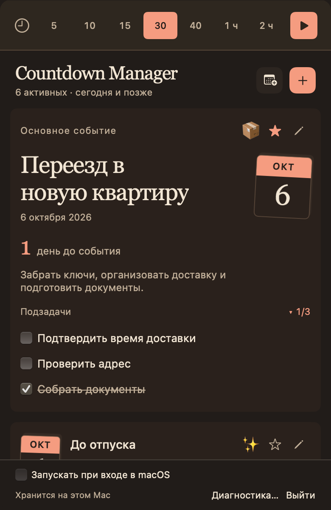
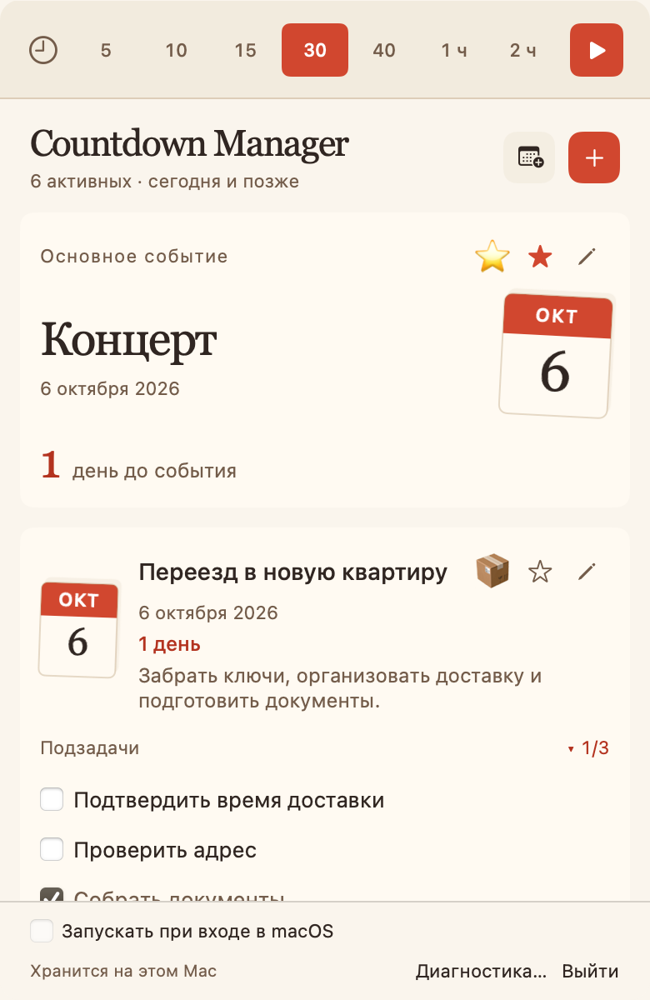
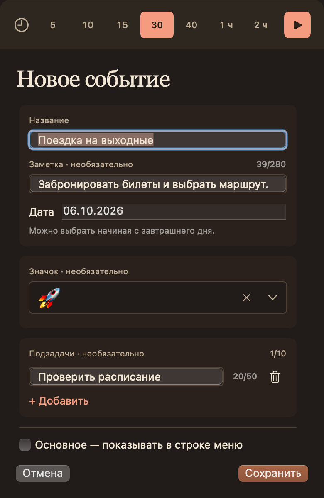
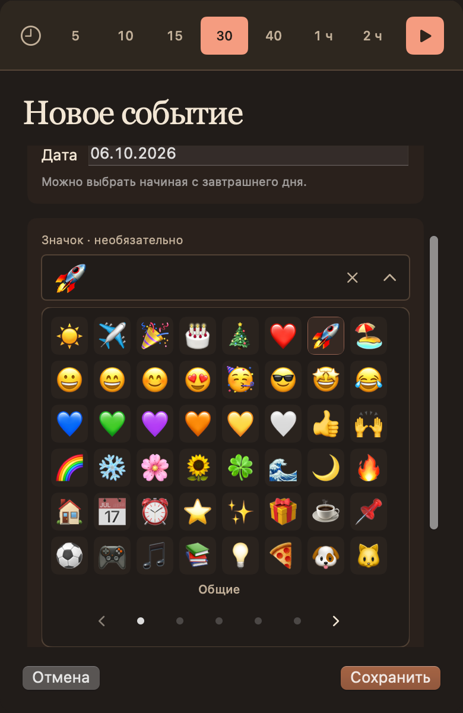
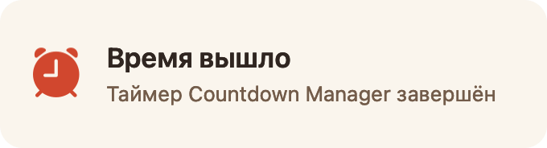

# Countdown Manager

Countdown Manager — компактное нативное приложение для строки меню macOS. Оно помогает ждать отпуск, день рождения, поездку или другое будущее событие и показывает, сколько календарных дней до него осталось. Это не todo-manager: дата события остаётся главной, а небольшой чек-лист лишь помогает подготовиться. Дополнительно в приложении есть один лёгкий таймер для коротких напоминаний по времени.

Учётная запись, подключение к интернету и уведомления не требуются.

Изменения версии 1.6.0 описаны в [заметках к выпуску](docs/releases/v1.6.0.md).

## Интерфейс версии 1.6.0

### События в тёмной и светлой теме




<details>
<summary>Редактор, выбор значка и завершение таймера</summary>

### Редактор и выбор значка




### Завершение таймера



</details>

## Установка готового приложения

Готовая публичная сборка рассчитана на Mac с Apple Silicon и macOS 13 или новее.

1. Откройте страницу [Releases](https://github.com/VDevGushin/CountdownManager/releases) и выберите последнюю опубликованную версию.
2. Скачайте приложенный ZIP-архив с `Countdown Manager.app` и распакуйте его.
3. Перенесите **Countdown Manager.app** в папку **«Программы»**.
4. При первом запуске нажмите приложение правой кнопкой мыши, выберите **«Открыть»** и подтвердите запуск.

Приложение пока подписано локальной ad-hoc подписью и не нотарифицировано Apple. Поэтому обычный двойной клик при первом запуске может быть заблокирован. Если команда **«Открыть»** не помогла, откройте **«Системные настройки» → «Конфиденциальность и безопасность»** и разрешите запуск приложения там.

Если на странице Releases ещё нет готового архива или используется Intel Mac, приложение можно [собрать из исходников](#сборка-из-исходников).

## Как пользоваться

После запуска в строке меню появится **◷ Countdown**; отдельной иконки в Dock нет.

1. Нажмите **◷ Countdown**, затем **+ Добавить событие**.
2. Укажите название и будущую дату. При желании добавьте заметку до 280 символов и подзадачи. Значок необязателен: новый черновик начинается с **«Без значка»**.
3. Для выбора значка нажмите поле **«Значок · необязательно»**. Оно раскроет восемь быстрых вариантов; **«Все значки»** открывает каталог из пяти наборов — **«Общие»**, **«Дети»**, **«Работа»**, **«Транспорт»** и **«Праздники»**. Переключайтесь стрелками, точками или горизонтальным свайпом. Выбор закрывает палитру; маленькая **×** внутри поля убирает значок.
4. Нажмите **«Сохранить»**. Если основное событие не выбрано, строка меню и крупная карточка покажут ближайшее событие, начиная с сегодняшнего дня. Первое сохранение не заполняет звезду автоматически.
5. Чтобы закрепить событие как основное, нажмите его пустую звезду. Повторное нажатие на заполненную звезду снимает выбор. Отметку **«Основное — показывать в строке меню»** также можно включить или снять в редакторе и сохранить.
6. Карандаш открывает редактор события: подзадачи, значок и удаление с подтверждением доступны в одном месте.

Редактор разделён на три блока: название, заметка и дата; значок; подзадачи. Выбор основного события расположен ниже, а **«Сохранить»** и **«Отмена»** остаются внизу панели при прокрутке формы. Интерфейс использует тёплую светлую и тёмную палитры и учитывает системное повышение контраста.

Изменения редактора попадают в данные только после **«Сохранить»**. **«Отмена»** отбрасывает черновик. Нажатие строки меню открывает под ней компактную панель без стрелки, заголовка и оконных кнопок на текущем Space; панель нельзя перемещать. **Command-W**, переход в другое приложение или на другой Space скрывают панель, сохраняя в памяти позицию списка, открытый редактор и введённый текст. Возврат на прежний Space сам её не показывает: новый клик по строке меню возвращает тот же сеанс, а если панель уже видна — скрывает её. Выход из приложения может сбросить несохранённые черновики.

Для планов на день нажмите кнопку с календарём **«Создать день»** рядом с **+**, затем выберите **«Завтра»** или **«Выбрать дату»**. Откроется тот же редактор с завтрашней датой и названием дня недели, например **«Понедельник»**. Дополнительный значок не выбран, заметка и список дел пустые. Для другой будущей даты измените поле **«Дата»**: название дня обновится автоматически, пока вы сами его не измените. После ручного изменения названия оно сохраняется при смене даты. Остальные поля тоже можно менять.

День появляется в списке только после **«Сохранить»** и работает как обычное событие; несколько событий на одну дату разрешены. Повторное действие создания при открытом редакторе не заменяет его черновик. Создание недели и библиотека сохранённых шаблонов пока не предусмотрены.

Над списком событий размещена полоса одного таймера: выберите фиксированную длительность и запустите её — подробности в разделе [«Таймер»](#таймер).

Автозапуск включается флажком **«Запускать при входе в macOS»** в нижней части панели. По умолчанию он выключен.

## События и карточки

- Событий может быть сколько угодно, в том числе несколько на одну дату.
- У каждого события есть календарный листок с его настоящим месяцем и числом без ведущего нуля, название, полная дата и отсчёт. Дополнительный значок отображается перед звездой, если выбран; заметка — если заполнена. Старый **📅** в списке не дублирует календарный листок, но остаётся в редакторе и данных.
- Крупная карточка показывает выбранное основное событие или ближайшее событие, если выбор снят. Её календарь находится справа; у остальных событий — слева. Карточки и их чек-листы объединены на мягких отдельных поверхностях.
- В дату события карточка и строка меню показывают `Сегодня`. Такое событие остаётся доступным весь календарный день: его можно редактировать, удалять, оставлять на сегодняшней дате или переносить в будущее.
- Новое событие можно создать только на дату позже сегодняшней. Прошлые даты недоступны.
- Выбранное основное событие стоит первым. Без выбора список начинается с ближайшей даты, включая сегодня, и крупная карточка называется **«Ближайшее событие»**. Автоматическое отображение не сохраняет выбор звезды. События одной даты сохраняют исходный порядок независимо от названий.
- После окончания даты событие автоматически удаляется без архива. Незавершённые подзадачи не задерживают удаление; просроченных событий и автоматического переноса в продукте нет.
- Если выбранное основное событие удаляется или истекает, выбор снимается и приложение автоматически показывает ближайшее оставшееся событие. При равной дате используется стабильный пользовательский порядок.

Когда событий нет, панель показывает короткое пустое состояние; новое событие можно создать кнопкой **+** в верхней части панели. Строка меню при этом показывает **◷ Countdown**.

## Подзадачи

У события может быть от 0 до 10 коротких подзадач. Каждая содержит только текст до 50 символов и состояние выполнения — без собственной даты, времени, приоритета, напоминания или вложенности. Подзадачи можно добавить сразу при создании события либо позже в редакторе события; checkbox выполнения доступен в карточке события, а не в редакторе.

- Выполненная подзадача остаётся видимой, зачёркивается и показывается ниже невыполненных. Её текст и отметка становятся спокойнее; строки чек-листа разделяются отступами, без горизонтальных линий. Внутри обеих групп сохраняется исходный пользовательский порядок.
- Checkbox можно снять: подзадача снова вернётся в группу невыполненных.
- Индикатор `▸ 2/8` или `▾ 2/8` показывает количество выполненных и общее количество. Раскрытие и сворачивание занимают 200 мс; состояние хранится отдельно для каждого события и восстанавливается после перезапуска.
- Добавление и удаление строк в редакторе сопровождаются коротким переходом 100 мс. Ввод текста не анимируется. При системном **«Уменьшении движения»** переходы происходят сразу.
- Если подзадач нет, блок и индикатор не показываются — значения `0/0` в интерфейсе нет.
- `10/10` не завершает и не удаляет событие досрочно. Оно продолжает жить до своей календарной даты.
- Длинный текст в карточке занимает одну строку, сокращается многоточием, а полный текст доступен в подсказке при наведении.

Уведомлений и напоминаний по событиям и подзадачам нет.

## Таймер

Помимо событий, в приложении есть ровно один таймер для коротких напоминаний — без названия и текста задачи.

- Когда таймер простаивает, выберите одну из семи фиксированных длительностей — 5, 10, 15, 30, 40, 60 или 120 минут — и запустите его. Произвольная длительность не предусмотрена.
- Пока таймер идёт, панель показывает `⏰` и остаток времени. Поставить на паузу, изменить или продлить длительность нельзя; единственное действие таймера — удалить его.
- Таймер хранит абсолютный момент окончания: закрытие панели, выход и повторный запуск приложения, сон Mac и обычный ход часов его не сбрасывают. Время, проведённое вне приложения, тоже идёт.
- Когда время истекает, таймер переходит в состояние `⏰ Время вышло` и остаётся в нём до удаления: играет встроенный звук, на пять секунд появляется собственное окно приложения поверх остальных окон. Оно оформлено в палитре приложения и не перехватывает фокус. Нажатие в любом месте сразу закрывает окно, сохраняя завершённый таймер.
- В окне завершения двигается только значок будильника: короткие наклоны и небольшие подъёмы чередуются с паузой. Текст и карточка неподвижны. При **«Уменьшении движения»** этот значок статичен.
- Отдельный значок будильника в строке меню продолжает покачиваться до удаления завершённого таймера; при **«Уменьшении движения»** он пульсирует.
- Это не системное уведомление: приложение не запрашивает разрешение на уведомления macOS. Если приложение не работало в момент окончания, после запуска просто восстановится состояние «время вышло» — без повторного звука и окна.
- Таймер не связан с событиями и подзадачами и не создаёт их.

## Строка меню

В строке меню отображается выбранное основное событие, а если выбор снят — ближайшее активное, включая сегодняшнее. Формат — значок и отсчёт, например `☀️ 1 день` или `☀️ Сегодня`; при пустом дополнительном значке используется **📅**. Название, дата, заметка, checkbox и прогресс подзадач туда не попадают. Если событий нет, отображается `◷ Countdown`.

Пока таймер работает, его показание временно занимает строку меню: `⏰ 29:59`, а после завершения — просто `⏰`, пока таймер не удалён. Удаление таймера возвращает отображение выбранного основного или ближайшего события.

## Данные и приватность

Все события и подзадачи хранятся только на текущем Mac в файле:

`~/Library/Application Support/CountdownManager/countdowns.json`

Старый JSON без поля `subtasks` полностью совместим и читается как событие без подзадач. Существующие идентификаторы, названия, заметки, даты, emoji и действующий выбор основного события сохраняются. Отсутствие дополнительного значка и снятый выбор основного события тоже сохраняются после перезапуска. Некорректный пользовательский JSON не исправляется и не перезаписывается молча: приложение оставляет файл без изменений и сообщает об ошибке.

Дни считаются по календарю, не делением секунд на 86400. Даты сохраняются как год/месяц/день; запись выполняется атомарно. Чтение, JSON-кодирование и запись происходят вне главного UI-потока. Последовательное хранилище и номера ревизий защищают новое состояние от запоздавшей записи, а неуспешное изменение откатывается в интерфейсе.

Состояние сворачивания чек-листов является отдельной настройкой интерфейса и не добавляется в `countdowns.json`.

## Диагностика

Приложение ведёт локальный журнал действий и ошибок:

`~/Library/Application Support/CountdownManager/Logs/countdown.log`

Когда файл достигает 512 КБ, предыдущая часть сохраняется как `countdown.previous.log`. Журнал содержит только технические факты: тип операции, UUID события или подзадачи, количество элементов, ревизию и результат. Названия, заметки, пользовательские emoji и текст подзадач никогда не записываются.

Если главный поток не отвечает 5 секунд, фоновый сторож добавляет `ui.stall detected`; после восстановления — `ui.stall recovered`. Папку можно открыть через кнопку **«Диагностика…»**.

## Сборка из исходников

Нужны Git и Apple Command Line Tools (`xcode-select --install`) либо полный Xcode.

```sh
git clone https://github.com/VDevGushin/CountdownManager.git
cd CountdownManager
./build.sh
open "Countdown Manager.app"
```

Скрипт создаёт локально подписанный `Countdown Manager.app` в корне проекта. Сборка выполняется под архитектуру текущего Mac.

## Проверки для разработчиков

```sh
./verify.sh fast  # CoreChecks + UIChecks
./verify.sh ui    # release build + Real UI Smoke
./verify.sh full  # оба набора
./run-xcui-tests.sh  # настоящий macOS XCUITest, требуется полный Xcode
```

`CoreChecks` покрывает валидацию событий и подзадач, редактирование события `Сегодня`, жизненный цикл, стабильный порядок, legacy/new JSON round-trip и revision ordering. `UIChecks` использует тот же presentation/state-слой, что и SwiftUI, и детерминированно проверяет пользовательские строки, карточку, дату и отсчёт, чек-лист, collapse-state, быстрые операции, empty state и строку меню. `Real UI Smoke` запускает собранное приложение в изолированном профиле: проверяет lifetime hosting/root, сохранение позиции списка и draft через hide/show панели, быстрый выбор emoji, сохранение и отмену, а также многократный collapse/expand при одном и нескольких событиях.

XCUITest-набор использует минимальный `CountdownManager.xcodeproj`, собирает отдельную тестовую копию приложения и запускается из CLI без ручного открытия Xcode. Каждый тест работает с собственным временным Application Support-профилем и fixture-данными; production `countdowns.json`, UserDefaults и журналы не используются.

Подробная карта verification surfaces и правила выбора достаточного evidence находятся в [`docs/VERIFICATION.md`](docs/VERIFICATION.md).

## Управление проектом через ИИ

Репозиторий содержит небольшой agent harness для сопровождения Countdown Manager.

Поведение агента проверяется отдельным набором [evals](evals/README.md): точечные исправления,
ревью без изменений, выбор доказательств и соблюдение продуктовых границ. Запуски используют
отдельные копии проекта; результаты оцениваются по действиям, независимым проверкам и рубрике.

Для обычной работы владельцу не нужно писать техническое ТЗ или выбирать Swift, SwiftUI или AppKit API. Достаточно описать проблему, желаемый пользовательский результат и важные ограничения.

Примеры:

```text
Исправь баг: после закрытия и повторного открытия окна список возвращается наверх.
```

```text
Проведи engineering review проекта. Ничего не меняй.
```

```text
Проверь agent harness на лишнюю сложность, дублирование и устаревшие правила. Ничего не меняй.
```

Обычный bug fix не требует отдельного специального workflow. Агент сам выбирает технический путь и достаточный уровень verification в пределах правил репозитория.

Основные agent-инструкции находятся в [`AGENTS.md`](AGENTS.md).

Канонические repository knowledge surfaces:

- [`docs/PRODUCT.md`](docs/PRODUCT.md) — текущее пользовательское поведение и product invariants;
- [`docs/ARCHITECTURE.md`](docs/ARCHITECTURE.md) — карта текущей реализации и ownership;
- [`docs/VERIFICATION.md`](docs/VERIFICATION.md) — verification surfaces и выбор evidence;
- [`docs/decisions/`](docs/decisions/) — принятые durable technical decisions;
- [`.agents/skills/macos-platform-research/SKILL.md`](.agents/skills/macos-platform-research/SKILL.md) — специализированное исследование неопределённого macOS/SwiftUI/AppKit поведения.

Scope, user-data protection и authority boundaries определены только в `AGENTS.md`, чтобы README не становился второй копией agent policy.

Нативные API: [NSStatusBar](https://developer.apple.com/documentation/appkit/nsstatusbar), [SMAppService](https://developer.apple.com/documentation/servicemanagement/smappservice/mainapp).
